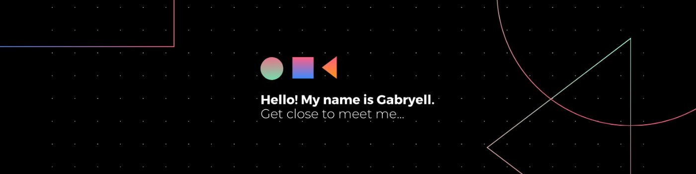

<!-- Cover -->

	

<!-- Info repo -->

	
	
	
	
	
	
	
	
	

<!-- Social Networks -->

	
	
	
	
	
	
	
	
	

<!-- Languages, libs and frameworks -->

	
	
	
	
	
	
	
	
	
  
	
	
	
  
  
  

<!-- Tools Front-end -->

	
	
	
	
	
	

## Olá! Seja muito bem-vindo(a) ao meu perfil. &#128075;&#127995;&#128079;&#127995;

👨🏻‍💻 Me chamo **Gabryell**, tenho 22 anos, sou formado em Informática para Internet, apaixonado por tecnologia, música e **Engenharia de Front-End**.

👨🏻‍🎓 Estava cursando [Inglês Pós-Intermediário](http://culturainglesaaraxa.com.br/curso/link/14/pos-intermediario-upper-intermediate) através da plataforma digital oferecida pela *Cultura Inglesa*, além de outros cursos especializados em tecnologia da informação. Estou desenvolvendo aplicações utilizando as tecnologias: **Sass**, **Scss**, **React.js**, **React Native**, **Next.js**, **Vue.js**, **Nuxt.js**, **Node.js**, **TypeScript** e **Firebase**.

## Habilidades 👨🏻‍💻

<!-- Skills -->
Algumas das minhas habilidades e conhecimentos como Engenheiro de Front-End:
- 💻 **Front-end**: HTML5, CSS3 (Media Query, Animation, Flexbox, Grid, Sass, Scss), JavaScript (Ajax, jQuery, ES6+), Bootstrap, Vuetify, React.js, Next.js, React Native, Vue.js e Nuxt.js.
- 🔠 **Linguagens**: HTML5, CSS3, JavaScript/ES6+, TypeScript e PHP.
- 🏷️ **Versionamento**: Git.
<!-- - 🧪 **Testes e automatização**: NPM, Jest, Gulp. -->
- 🎲 **Banco de Dados**: Linguagem SQL, Modelagem de dados, MySQL, Firebase Database e Firebase Firestore.
- 🏗️ **Infraestrutura**: HTTP, Windows 10.
- 👷🏻 **Arquitetura**: MVC, Rest, Orientação a Objetos.
- 📈 **Engenharia de Software**: Levantamento de requisitos, UML, Scrum e Kanbam.

<!-- Projects -->
## Projetos 📊

Meu top 3 de projetos mais famosos: 🏆
1. 🥇 [iZiFinance](https://izifinance.com/) · Tenha total controle do seu negócio 24/7!
2. 🥈 [SOS Plantão](https://sosplantao.com/) · Facilite a gestão de plantões!
3. 🥉 [Rede Social](https://rede.social) · Participe da sua Rede Social favorita em apenas poucos cliques!

<!-- GitHub Stats -->
## Estatísticas do GitHub &#129302;

	

	

	

<!--
**theSpiderDev/theSpiderDev** is a ✨ _special_ ✨ repository because its `README.md` (this file) appears on your GitHub profile.

Here are some ideas to get you started:

- 🔭 I’m currently working on ...
- 🌱 I’m currently learning ...
- 👯 I’m looking to collaborate on ...
- 🤔 I’m looking for help with ...
- 💬 Ask me about ...
- 📫 How to reach me: ...
- 😄 Pronouns: ...
- ⚡ Fun fact: ...
-->
